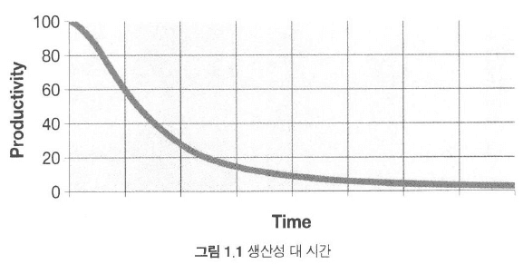

- this list will be replaced by the toc
{:toc .large-only}

## 코드는 존재하리라 
***

- 코드: 기계에게 요구사항을 상세히 표현하는 수단
- 추상화 수준이 높아지고 Domain-Specific Language가 많아져도 코드의 종말은 오지 않을 것

## 나쁜 코드
***

> **Later Equals Never** (나중은 결코 오지 않는다) - _르블랑의 법칙 (Leblance's Law)_

- 기한을 맞추기 위해 허겁지겁 코드를 짜면 이전 버전에 있던 버그가 다음 버전에도 보이며 문제가 커질 것
- **고행** (wading) : 나쁜 코드를 헤쳐 나가는 것 

## 나쁜 코드로 치르는 대가
***

{:.lead width="800" height="100" loading="lazy"}

클린코드 pg 5
{:.figcaption}

- 나쁜 코드가 많을수록 팀 생산성은 0에 수렴함
- 아무리 관리자와 마케팅팀, 사용자가 무리한 요구를 해도 결국엔 **개발자에게 책임**이 있다

> "나쁜 코드의 위험을 이해하지 못하는 관리자의 말을 그대로 따르는 행동은 전문가답지 못하다"

- 기한을 맞추는 유일한 방법은 (빨리가는 유일한 방법) = **언제나 코드를 최대한 깨끗하게 유지하는 습관**

- **코드 감각** 이 있다고 깨끗한 코드를 작성하는것은 아님 <fade>(마치 그림보는 감각이 있더라도 그림을 실제로 그리지는 못하는 것처럼)</fade>

## 깨끗한 코드란?
***
- 거장들의 정의

### 비야네 스트룹스트룹

- Bjarne Stroustrup: **C++ 창시자**, _The C++ Programming Language_ 저자

> 나는 **우아하고 효율적**인 코드를 좋아한다. **논리가 간단**해야 버그가 숨어들지 못한다. **의존성을 최대한 줄여야 유지보수가 쉬워진다**. **오류는 명백한 전략에 의거해 철저히 처리**한다. **성능을 최적으로 유지**해야 사람들이 원칙 없는 최적화로 코드를 망치려는 **유혹**에 빠지지 않는다. 깨끗한 코드는 한 가지를 제대로 한다.

- 우아한, 보기에 즐거운 코드를 지향
- 효율: 속도뿐만이 아닌, CPU자원을 낭비하지 않는 코드
- 나쁜 코드는 또 다른 나쁜 코드를 유혹한다
    - **깨진 창문** (David Thomas, Andrew Hunt) : 창문이 깨진 건물은 누구도 상관하지 않는다. 창문이 더 깨져도 사람들은 관심이 없다. 건물에 쓰레기가 쌓여도 방치되며 쇠퇴하는 과정이 시작된다.
- 오류 처리: 개발자가 대충 넘어가는 부분 중 하나
    - <fade>메모리 누수, 경쟁상태 (Race condition), 일관성 없는 명명법</fade>
- 한가지를 잘한다 $$\Rightarrow$$ 한가지에 **집중**한다 (현혹, 오염X)

### 그래디 부치
- _Object Oriented ANalysis and Design with Application_ 의 저자 

> 깨끗한 코드는 **단순하고 직접적**이다. 깨끗한 코드는 **잘 쓴 문장처럼 읽힌다**. 깨끗한 코드는 결코 **설계자의 의도를 숨기지 않는다**. 오히려 명쾌한 추상화와 단순한 제어문으로 가득하다. 

- **가독성** 강조, **명쾌한** (crisp) 추상화

### Big Dave Thomas

- OTI 창립자, Eclipse 전략의 대부

> 깨끗한 코드는 **작성자가 아닌 사람도 읽기 쉽고 고치기 쉽다**. 단위 테스트 케이스와 인수 **테스트케이스가 존재**한다. 깨끗한 코드에는 **의미 있는 이름**이 붙는다. 특정 목적을 달성하는 방법은 (여러가지가 아니라) **하나만 제공**한다. **의존성은 최소**이며 각 의존성을 명확히 정의한다. API는 명확하며 최소로 줄였다. 언어에 따라 필요한 모든 정보를 코드만으로 명확히 표현할 수 없기에 코드는 **문학적으로 표현**해야 마땅하다. 

- 가독성과 **다른** 사람이 고치기 쉬운
- TDD! 테스트케이스 필수 
- 문학적 프로그래밍 (Literate Programming): 대충 인간이 읽기 좋은 코드를 작성하라는 뜻

### 마이클 페더스 

- _Working Effectively with Legacy Code_ 저자 

> 깨끗한 코드의 특징은 많지만 그 중에서도 모두를 아우르는 특징이 하나 있다. 깨끗한 코드는 언제나 누군가 <cb>주의 깊게 짰다는 느낌을 준다</cb>. 고치려고 살펴봐도 딱히 손 댈 곳이 없다. 작성자가 이미 **모든 사항을 고려**했으므로, 고칠 궁리를 하다보면 언제나 제자리로 돌아온다. 그리고는 누군가 남겨준 코드, 누군가 주의 깊게 짜놓은 작품에 감사를 느낀다.

### 론 제프리스

- _Extreme Programming Installed_, _Extreme Programming Advanture in C#_ 의 저자 
- 거의 모든 플랫폼에서 거의 모든 언어로 코드를 구현해봄

> 최근들어 나는 켄트 백이 제안한 단순한 코드 규칙으로 구현을 시작한다. (끝도 마찬가지) 중요한 순으로 나열하자면 간단한 코드는:
       - 모든 테스트를 통과한다
      - **중복이 없다**
      - 시스템 내 모든 설계 아이디어를 표현한다 (변수명 등)
      - 클래스, 메서드, 함수 등을 최대한 줄인다 (초반부터 간단한 추상화 고려)

### 워드 커닝햄
- 위키 창시자, 익스트림 프로그래밍 공동 창시자, 디자인 패턴을 뒤에서 움직이는 전문가, 스몰토크와 객체지향의 정신적 지도자...etc 

> 코드를 읽으면서 짐작했던 기능을 각 루틴이 그대로 수행한다면 깨끗한 코드라 불러도 되겠다. 코드가 그 문제를 풀기 위한 언어처럼 보인다면 아름다운 코드라 불러도 되겠다. 

- 단순하게 보이는 의무는 개발자들에게 있다

## 보이스카우트 규칙

**캠프장은 처음 왔을 때보다 더 깨끗하게 해놓고 떠나라**
{:.lead}

- 잘 짠 코드가 전부는 아니다
- 시간이 지나도 언제나 깨끗하게 유지해야 한다 (엉망으로 전락 방지)

## 개인 회고

드디어 그 유명한 보이스카우트 규칙이 뭔지 알아냈다. 이에 동의하는 포스트도, 경계하는 포스트도 본 것 같다. 아직 굴리고 있는 프로젝트가 트래픽이 많지 않고 나 또한 이제 막 개발을 시작한 개발자다 보니 이에 대해 동의/비동의 하기는 어려운 것 같다.  

해당 챕터는 클린코드를 지향해야 하는 이유를 업계 거장들의 의견으로 나열했다. 개중 아직 이해는 못하는 이유들도 있지만, 최근에 프로젝트에 Test Code를 작성하자는 의견이 나왔는데, 데이브 토마스의 클린코드 정의를 보고 꼭 해봐야겠다고 생각이 든다. 

잘 쓴 코드는 고치려고 했을떄 군더더기 없는 코드라는게 특히 공감이 간다. 최근에 6개월 전 진행한 해커톤 프로젝트를 리팩토링을 시작해서 옛날에 엉망진창으로 작성한 코드들을 봤는데 유독 한 사람이 작성한 코드는 깔끔했고 손댈 곳이 없었으며 심지어 거기서 더 배워서 다른 부분에 적용시켰다. 6개월 안에 많은 성장을 했다고 자부했는데 아직 갈길이 멀구나를 몸소 느낀 계기였다.

(TMI) 노션 중독이던 내가 이제는 비쥬얼스튜디오에서 마크다운으로 작성하는게 편해졌다..

