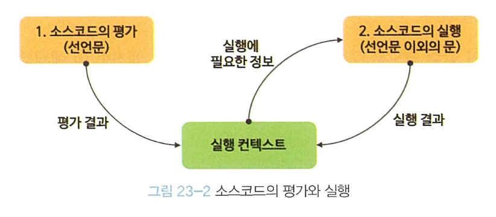
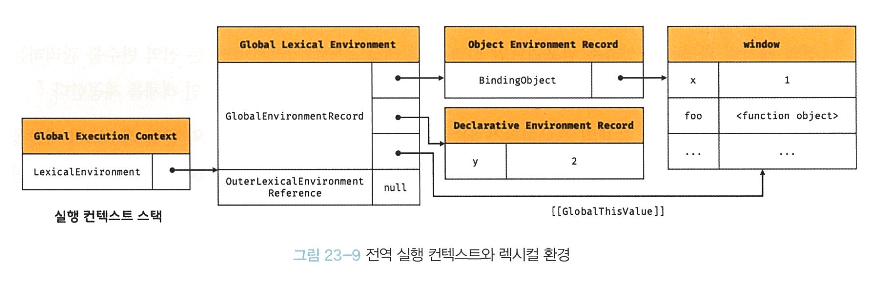
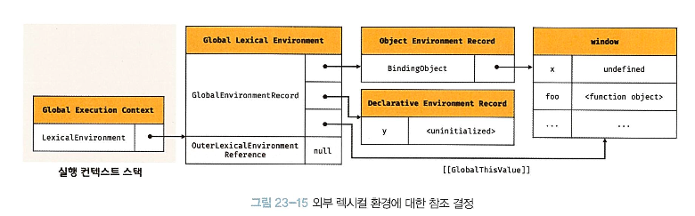
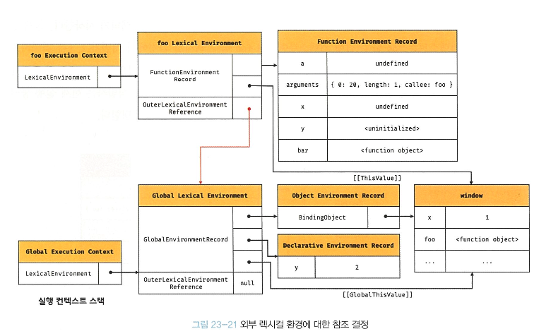
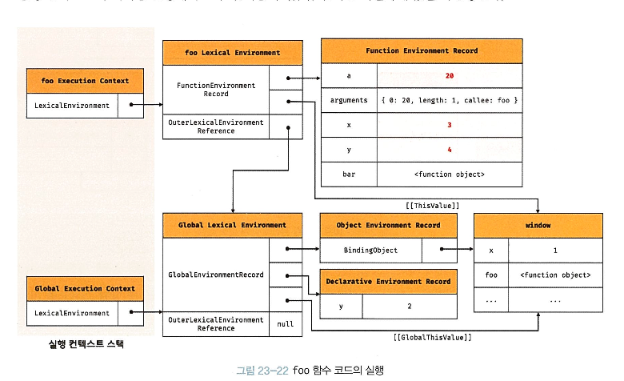
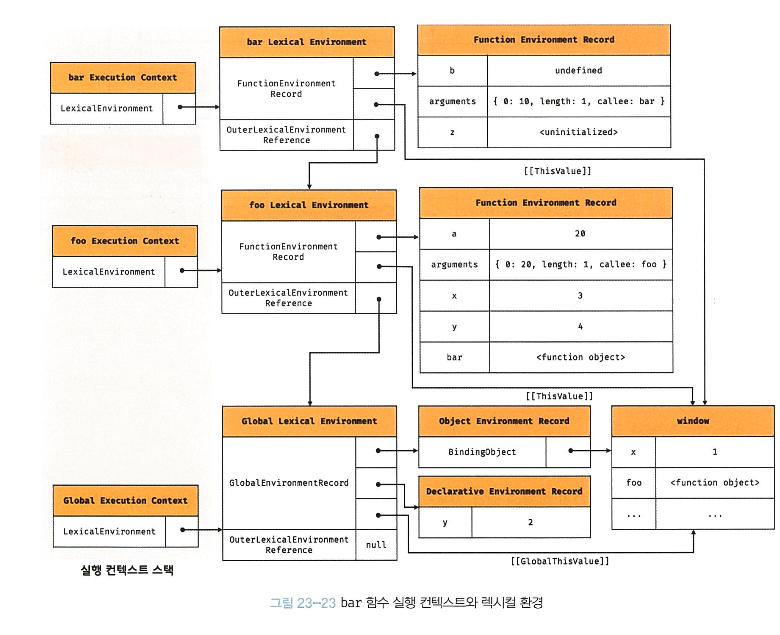
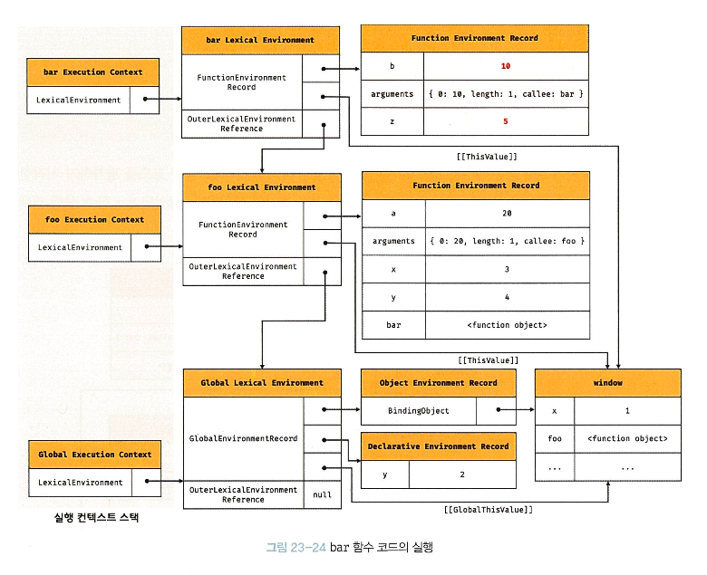

{:toc .large-only}

## 23.1 소스코드의 타입

---

ECMAScript code 4가지 타입 (which creates 실행컨텍스트)

- 구분 이유: 타입에 따라 **생성 과정과 관리 내용이 다르다**
- 각 코드 평가 시 생성됨

1. **전역 코드** : 전역 정의된것만 (함수, 클래스 내부코드는 X)

   - 전역 변수 -> (bind) -> 전역 객체의 프로퍼티
   - 전역 함수 -> (bind) -> 전역 객체의 메소드 (can reference 전역 프로퍼티)

2. **함수 코드** : 함수 내부 코드 (중첩 함수, 클래스 내부는 X)
   - 지역 스코프 생성
   - 지역 변수, 매개변수, arbuments 객체 관리
   - 생성된 스코프 전역 스코프의 체인으로 연결
3. eval 코드 : (built-in eval맞음) 인수로 전달되는 소스코드
   - strict mode 에서 독자적인 스코프 생성
4. 모듈 코드 : 모듈 내부 (마찬가지로 내부의 함수, 클래스의 내부는 포함 X)
   - 모듈별로 독립적인 스코프 생성

## 23.2 소스코드의 평가와 실행

`소스코드 평가` $$\rightarrow$$ `소스코드 실행`

{:.lead width="200" height="50" loading="lazy"}

1. 소스코드 평가

   - 실행 컨텍스트 생성
   - 선언문 먼저 실행 (변수, 함수 등)
   - 위 식별자들을 실행 컨텍스트가 관리하는 스코프 (렉시컬 환경의 레코드)에 키로 등록

2. 소스코드 실행 (`RUN TIME`)

   - 필요한 정보 (변수, 함수 참조)를 실행 컨텍스트가 관리하는 스코프에서 검색 후 사용
   - 위 결과를 다시 스코프에 등록

- ex:

  ```js
  var x;
  x = 1;
  ```

  - (평가)

  1. 실행 컨텍스트가 관리하는 스코프에 `x` (key) 등록
  2. `undefined`로 초기화됨

  - (실행)

  1. 스코프에 `x` 등록여부 확인
  2. `x`키값의 값 `1`로 할당
  3. 실행 컨텍스트에 등록

## 23.3 실행 컨텍스트의 역할

---

EXAMPLE:

```js
const x = 1;
const y = 2;

function foo(a) {
  const x = 10;
  const y = 20;
  // 메서드 호출
  console.log(a + x + y); // 130
}

// 함수 호출
foo(100);

// 메서드 호출
console.log(x + y); // 3
```

|     | 순서                | 동작                                                                                                                                                                                                                                                     |
| --- | ------------------- | -------------------------------------------------------------------------------------------------------------------------------------------------------------------------------------------------------------------------------------------------------- |
| 1.  | 전역 코드 평가      | - 전역 변수, 함수 선언문 실행 뒤 컨텍스트 전역 스코프에 등록                                                                                                                                                                                             |
| 2.  | 전역 코드 실행      | - 런타임 시작 (순차적). 전역 변수 값 할당, 함수 호출. <br/>- 함수 호출 시 순차적 전역코드 실행 일시 중단!<br/> - 실행 순서 변경하여 함수 내부로 진입                                                                                                     |
| 3.  | 함수 코드 평가      | - 매개변수, 지역 변수 선언문 실행 <br/>- 지역 스코프에 등록 <br/>- arguments 객체 생성 -> 지역 스코프에 등록 <br/>- `this`바인딩 결정                                                                                                                    |
| 4.  | 함수 코드 실행      | - 런타임 시작. <br/>- `console.log`메서드 호출 위해 `console` 식별자 스코프 체인에서 검색 (전역 객체에 프로퍼티) <br/>- console객체 프로토타입 체인에서 `log`메서드 검색 <br/>- `a + x + y`평가 (식별자들은 스코프 체인 통해 검색) <br/>- 함수 실행 종료 |
| 5.  | 전역 코드 게속 실행 | .                                                                                                                                                                                                                                                        |

- $$\Rightarrow$$ 코드 실행 위해 스코프 구분 + 식별자 바인딩 값 관리 필요
- 중첩 위해 스코프 체인 생성, 식별자 검색 필요
- 전역 객체의 프로퍼티가 전역 변수처럼 검색할 수 있게 필요

ALSO

- `실행중인 코드`, `실행하던 코드` 구분 관리 필요!!!
  - 함수 호출 종료 시 호출 이전으로 돌아가기 위해

> From the books: <br/>

1. 선언에 의해 생성된 모든 식별자(변수, 함수, 클래스 등)를 스코프를 구분하여 등록하고 상태 변화(식별자에 바인딩된 값의 변화)를 지속적으로 관리할 수 있어야 한다.
2. 스코프는 중첩 관게에 의해 스코프 체인을 형성해야 한다. 즉, 스코프 체인을 통해 상위 스코프로 이동하며 식별자를 검색할 수 있어야 한다.
3. 현재 실행 중인 코드의 실행 순서를 변경(예를 들어, 함수 호출에 의한 실행 순서 변경)할 수 있어야 하며 다시 되돌아갈 수도 있어야 한다.

- $$\Longrightarrow$$ 실행 컨텍스트!

`📌 wrap-up`

- 그래서 실행컨텍스트는요...

  - 소스코드를 실행하는데 필요환경 제공
  - 코드 실행 결과 실제로 관리하는 영역

  | 실행컨텍스트의 기능 | 관리 영역      |
  | ------------------- | -------------- |
  | - 렉시컬 환경       | 식별자, 스코프 |
  | - 스택              | 코드 실행 순서 |

## 23.4 실행 컨텍스트 스택

---

- 전역 코드, 함수 코드의 각각 컨텍스트는 스택으로 관리됨
- 말그대로 평가 시 `push` 되고 종료 시 `pop`된다

```js
// 1. 전역 코드 평가 + 컨텍스트 생성 (stack: ['전역컨텍스트(x, foo)'])
const x = 1;

function foo() {
  // 3. 함수 코드 평가 + 컨텍스트 생성  (stack: ['전역컨텍스트(x, foo)', 'foo컨텍스트(y, bar)'])
  const y = 2;

  function bar() {
    // 5. 함수 코드 평가 + 컨텍스트 생성 (stack: ['전역컨텍스트(x, foo)', 'foo컨텍스트(y, bar)', 'bar컨텍스트(z)'])
    const z = 3;
    console.log(x + y + z);
    // 6. bar 종료 -> 제어권 foo로
    // (stack: ['전역컨텍스트(x, foo)', 'foo컨텍스트(y, bar)'])
  }

  // 4. bar 호출 -> foo컨텍스트 일시중단, 코드 제어권 bar로
  bar();
  // 7. foo 종료 -> 제어권 전역으로
  // (stack: ['전역컨텍스트(x, foo)'])
}

// 2. foo 호출 -> 전역코드 실행 일시중단, 코드 제어권 foo 함수 내부로 이동
foo(); // 6
// 8. 전역 종료 -> DONE
// (stack: [])
```

- **Running Execution Context**: 현재 실행중인, 가장 최상위 (last-in) 실행 컨텍스트

## 23.5 렉시컬 환경

---

| 실행컨텍스트의 기능 | 관리 영역      |
| ------------------- | -------------- |
| - >> 렉시컬 환경    | 식별자, 스코프 |
| - 스택              | 코드 실행 순서 |

**실행 컨텍스트:**

- ㄴ `LexcialEnvironment` 컴포넌트 ( 렉시컬 스코프의 실체, 저장소 역할)
  - ㄴ `EnvironmentRecord` 컴포넌트 (식별자, 식별자 바인딩된 값)
  - ㄴ `OuterLexicalEnvironmentReference` 컴포넌트 (상위 스코프 참조로 링크드리스트 가능케 함)
- ㄴ `VariableEnvironment` 컴포넌트

- 생성 초기: 둘 다 동일 렉시컬 환경 참조
- 이후 : `VariableEnvironment`위해 새로운 렉시컬 환경 생성 -> 내용 달라짐 (더 깊게 안감)

## 23.6 실행 컨텍스트의 생성과 식별자 검색 과정

---

- 아래 코드의 순서를 천천히 뜯어보자

```js
// (1) 전역객체 생성
// (2) 전역코드 평가 : 컨텍스트, 전역 환경 레코드 생성 (객체환경: x, foo, 선언적환경: y)
// (3) 전역코드 실행 : x->1, y->2, foo->functionobj 넣음
var x = 1;
const y = 2;

function foo(a) {
  var x = 3;
  const y = 4;

  function bar(b) {
    const z = 5;
    console.log(a + b + x + y + z);
  }

  bar(10);
}

// (4) foo 함수 코드 평가
foo(20); // 42
```

### 1. 전역객체 생성 (전역 코드 평가 전)

- built-in 전역 프로퍼티, 함수, 표준 built-in 객체 추가
- 동작환경 (client-side/server-side)에 따른 객체들 추가

  - ex: client-side: WebAPI [DOM, BOM, Canvas, XMLHttpRequest, fetch, requestAnimationFrame, SVG, Web Storgae, Web Component, Web Worker ..etc]
  - or other host객체들

- Object.prototype상속 받음 (전역 객체도 체인됨)

  ```js
  window.toString(); // [object Window]
  window.__proto__.__proto__.__proto__.__proto__ === Object.prototype; // true
  ```

### 2. 전역코드 평가 (after loading sourcecode)

{:.lead width="200" height="50" loading="lazy"}

#### 1. 전역실행 컨텍스트 생성

- pushed to stack

#### 2. 전역 렉시컬 환경 생성 (+ `1`에 binding)

---

**2.1** 전역 환경 레코드 생성 (전역 스코프 역할)

- ES6 이전: 전역객체 === 전역환경 레코드 역할
- ES6 이후: let, const는 개념적 블록에 존재

- **_2.1.1_** 객체 환경 레코드 생성

  - 기존 `var` 변수, `function` 전역함수
  - built-int전역 prop, 함수, 표준 built-in객체 관리
  - `BindingObject` (전역객체생성에서 생성됨)와 연결되어서 전역객체의 prop, method가 되는 것.

    - $$\rightarrow$$ `window.alert`를 `alert`로 참조할 수 있는 메커니즘 (??)

  - `this`없음

- **_2.1.2_** 선언적 환경 레코드 생성

  - `let`, `const`의 전역 변수 관리
  - `this`없음

|                   | var              | function            | let, const         |
| ----------------- | ---------------- | ------------------- | ------------------ |
| 환경              | 객체 환경 레코드 | 객체 환경 레코드    | 선언적 환경 레코드 |
| 초기값            | `undefined`      | `<function object>` | $$uninitialized$$  |
| 선언, 초기화 단계 | 일치             | 일치                | 분리               |
| 선언문 이전 참조  | 가능             | 가능                | TDZ                |

**2.2** this 바인딩

- `Global Lexical Environment`.`[[GlobalThisValue]]` = `window` object
- this binding ONLY IN 전역환경 레코드 (Global Lexical Environment) AND 함수 환경 레코드

**2.3** 외부 렉시컬 환경에 대한 참조 결정

- 상위 스코프 가리킴 (Singly Linked List 생성)
- 이 경우(전 역 렉시컬 환경)에는 `null`

{:.lead width="200" height="50" loading="lazy"}

### 3. 전역 코드 실행

- 변수 할당문 -> `x`, `y`에 값 할당
- 식별자 결정 (identifier resolution): 어느 스코프의 식별자 사용할 것인지
- 현재 (실행 중인 실행 컨텍스트)에서 검색 시작함!
  - 없으면 상위 스코프로 타고 올라감
  - 종점 (전역 렉시컬 환경)까지도 없으면 `ReferenceError`

{:.lead width="200" height="50" loading="lazy"}

### 4. foo 함수 코드 평가

#### 1. 함수 실행 컨텍스트 생성

- `foo 함수 실행 컨텍스트` 스택에 push $$\rightarrow$$ 실행중인 실행 컨텍스트가 됨 (Running execution context)

#### 2. 함수 렉시컬 환경 생성 (+ `1`에 binding)

**2.1** 함수 환경 레코드 생성

**2.2** this 바인딩

**2.3** 외부 렉시컬 환경에 대한 참조 결정

- '평가 시점'에 평가!! 
- 함수를 어디서 호출했는지가 아니라 (dynamic scoping)
- 함수를 **어디에 정의**했는지 (static/lexical scoping)!!!

- `function Lexical Environment`.`OuterLexicalEnvironmentReference`.`[[Environment]]` -> 렉시컬 스코프 구현하는 메커니즘

{:.lead width="200" height="50" loading="lazy"}

### 5. foo 함수 코드 실행

- 와라랄라 들어감 

{:.lead width="200" height="50" loading="lazy"}

### 6. bar 함수 코드 평가

- 제어권 이동, 똑같이 실행컨텍스트, 렉시컬 환경 생성

{:.lead width="200" height="50" loading="lazy"}

### 7. bar 함수 코드 실행

{:.lead width="200" height="50" loading="lazy"}
