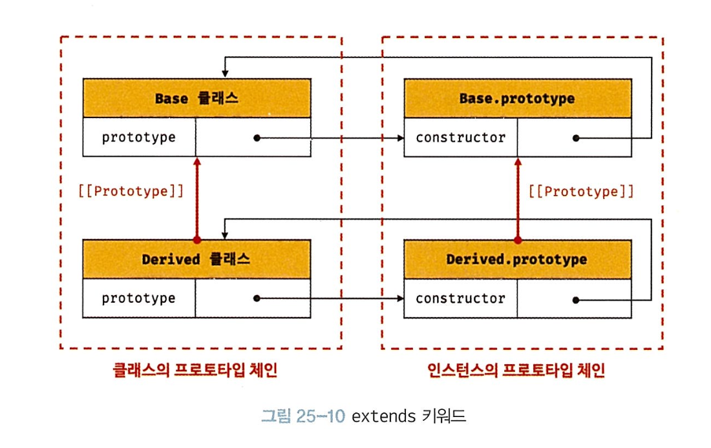

{:toc .large-only}

### 25.1 클래스는 프로토타입의 문법적 설탕인가

- 맞긴함. 클래스는 ES6에서 도입되었으며, 그 전에는 클래스 키워드 없이도 상속 구현 가능했다
- JS 의 `class`는 새로운 객체 생성 메커니즘 소개

|                 | class                                    | 생성자 함수                                                  |
| --------------- | ---------------------------------------- | ------------------------------------------------------------ |
| `new` 키워드    | 필수 (없으면 에러)                       | 있으면 - instance <br/> 없으면 - 일반함수로 호출             |
| `extneds/super` | O                                        | X                                                            |
| hoisting        | 발생하지 않는 것 처럼 (let, const의 TDZ) | 함수 선언문 - 함수 hoisting <br/>함수 표현식 - 변수 hositing |
| strict mode     | 암묵적 지정, 해제 불가                   | 지정 X                                                       |
| Enumerable      | False                                    | True                                                         |

### 25.2 클래스 정의

- 클래스 또한 일급 객체
- 클래스에서 정의가능 한 메서드: 1) constructor, 2) 프로토타입 메서드, 3) 정적 메서드
- 정의 방법은 생성자 함수의 정의 방식과 유사하다. 메서드에서 더 살펴봄.

### 25.3 클래스 호이스팅

- 생성자 함수로 평가됨 (typeof 하면 function나옴)
- => 런타임 이전에 (평가 과정에서) 함수 객체 생성

<details> <summary>hoisting 이 발생하지 않는 것처럼 동작 (하지만 발생함)</summary>

<div markdown="1">

- 발생하지 않는 것처럼 동작

  ```ts
  console.log(Person); // ReferenceError 발생

  class Person {}
  ```

- 하지만 발생함 (실제 발생 안한다면 ReferenceError대신 '' 출력되어야 함)

  ```ts
  const Person = "";
  {
    console.log(Person); // ReferenceError
    class Person {}
  }
  ```

</div>
</details>

### 25.4 인스턴스 생성

- class 존재 이유: 인스턴스 생성. 따라서 `new` keyword 필수
- 기명 클래스 표현식의 이름으로 생성 시 에러 발생

  ```ts
  const Person = class MyClass {}; // <--- `MyClass` 해당 스코프에서는 접근 불가, 안에서만 가능

  const me = new Person(); // GOOD
  const you = new MyClass(); // BAD - ReferenceError
  ```

### 25.5 메서드

{:.lead width="200" height="50" loading="lazy"}

#### constructor 메소드

- 클래스 -> 생성자 함수로 평가 -> 함수의 고유 props 가지고 있음.
- class > prototype > constructor 은 본인 class 가르킴

- class의 constructor과 생성자 함수의 constructor 은 관련 없음

  - class 의 constructor 메소드는 함수 객체로 평가 시 사라지고 다른 방벙으로 일부가 됨
  - 인스턴스의 property로 들어간다
  - 따라서, 인스턴스를 로그찍어보면 나오는 constructor은 class constructor이 아니라 prototype constructor (생성자)

- constructor에서 return 넣어주면 안됨. 암묵적으로 this return 하기 때문
  - `return {}` : this 를 override해서 {} 를 넘겨줌
  - `return 원시값`: 무시되고 this return 됨

### prototype 메서드

- 인스턴스에서 사용하기 위함. 프로토타입 체인에 추가됨
- 동적으로 추가가 가능
- this binding: 인스턴스 가르킴

#### static 메서드

- class 자체에서 사용하기 위함. 인스턴스 없이도 호출 가능
- 프로토타입 체인에 추가 안되기에 인스턴스에서 사용 불가
- **클래스에 바인딩된 메서드가 되는 것**
- this binding: class 가르킴

| prototype method                                                                                      | static method                                                                                      |
| ----------------------------------------------------------------------------------------------------- | -------------------------------------------------------------------------------------------------- |
| {:.lead width="200" height="50" loading="lazy"} | {:.lead width="200" height="50" loading="lazy"} |

### 25.6 인스턴스 생성과정

1. `new ClassName()` 으로 생성 -> this 는 빈 객체 인스턴스 `{}` 생성
2. 인스턴스의 prototype 을 `ClassName()`의 prototype으로 설정
3. (1)번의 빈객체를 this 와 바인딩함 (아직 미완성 인스턴스, prop없음)
4. constructor을 토대로 this (`{}`) 초기화함
5. 암묵적으로 this 반환

### 25.7 프로퍼티

- 인스턴스 프로퍼티 (constructor 메소드 내부 프로퍼티). public 함

  - private 필요 시 class 몸체에 `#privatePropertyName`으로 생성

- 접근자 프로퍼티 (get-return 필요, set-args필요)
  - prototype property이다. `this`접근 가능

```
TC39 process
stage 0 -> stage 1 -> stage 2 -> stage 3 -> stage 4 (final)

3 도달하면 4(출시)는 거의 확정이기에 최신 브라우저는 미리 구현하는 경향이 있다
```

- Class Field property: (2025에 [통과](https://developer.mozilla.org/en-US/docs/Web/JavaScript/Reference/Classes/Public_class_fields)된듯?)

  - 몸체에 정의 가능

  ```ts
  class Person {
    name = "Lee"; // 이렇게!
  }
  ```

  - 모든 class field property는 인스턴스 메소드가 됨 (prototype method)
  - 근데 class field property에 함수도 넣을 수 있음 (함수는 일급객체임으로) => 비추!!
  - 이렇게 되면 정적 메소드가 아니라 프로토타입 메소드 되니 주의 (혼동)

  ```ts
  class Person {
    name = "Lee";
    getName = () => this.name; // class field property (prototype method)
    sayHi() {
      console.log(this.name);
    } // prototype method
    static sayName = () => console.log(this.name); // static method
  }
  ```

  - 외부 값에 의해 초기화 필요없는 상황이면 class field property 사용 굳
  - 초기화 필요 시 constructor 내부에 인스턴스 프로퍼티로 정의할 것

- private field 프로퍼티

  - 몸체에 `#privateFieldName`으로 정의. constructor에서 정의 시 에러
  - 클래스에서만 접근 가능, 인스턴스에서 접근 불가. (접근자 property로 가능하긴 함)

- static field 프로퍼티: like Math.PI <- 값처럼 활용 가능

### 25.8 상속에 의한 클래스 확장

- 클래스 상속이 생성자 함수 상속과 어떻게 다른가
  - 클래스 상속: 기존 클래스를 상속받아 확장 (`extends`)
  - 생성자 함수 상속: 프로토타입 체인을 통해 다른 객체의 자산을 상속.
    - 상속을 통해 다른 생성자 함수를 확장은 불가능

<details> <summary>클래스, 프로토타입 상속 시각화</summary>

<div markdown="1">
{:.lead width="200" height="50" loading="lazy"}

</div>
</details>

#### `extends`

<details> <summary>클래스도 프로토타입을 통해 상속 관계를 구현함</summary>
<div markdown="1">

{:.lead width="200" height="50" loading="lazy"}

</div>
</details>

- 인스턴스의 프로토타입 체인 뿐 아니라 **클래스 간의 프로토타입 체인도** 생성함
- => 프로토타입 메서드, 정적 메서드 모두 상속 가능

  ```ts
  class Base {}
  class Derived extends Base {}

  const base = new Base();
  const derived = new Derived();
  ```

- 동적 상속: 동적으로 상속대상 결정 가능하다…! class x extends (condition ? y : z )

#### `super`

- subclass에서 constructor 생략 시 자동으로 넣어줌 (superclass꺼 죄다 복제)
- super keyword:

  - 호출용 (`super()`): 상위 constructor 호출함 (함수로 동작). constrcutor 내부에 무조건 호출되어야 함. 호출 전에 this 사용 불가. subclass에서만 사용 가능 (super() 호출 전에 this 사용 불가)
  - 참조용 (`super.sayHi()`): super class 의 메소드 호출 가능하고 prototype chain 내에꺼만 가능
  - super 은 class 고유 개념이 아니다. 객체 리터럴에서도 사용 가능함

- extension 후 인스턴스 생성

  1. [[ConstructorKind]] = `‘base’ | ‘derived’` 에 따라 new + className() 호출될때 동작 달라짐
     - if ‘base’: this = {} 바인딩 시킴
     - else ‘derived’: instance 생성 superclass 한테 위임 (super꼭꼭 호출해야 하는 이유)
  2. superclass에서 인스턴스 생성
     - base 에서 만들어졌지만 new.target찍어보면 derivedClass명 나옴. 거기서 만든것처럼 처리!
  3. superclass에서 인스턴스 초기화: this = {} ← 바인딩 하고 채워넣기
  4. subclass로 복귀 및 this 바인딩,
     - super 끝나면 제어흐름 subclass로 넘어옴.
     - 거기서 return 된 instance 객체, 이걸 this binding 함 (새로 생성하는거 아님!)
  5. subclass 인스턴스 초기화
     - this에 subclass instance property 끼워넣음
  6. instance 암묵적 반환

- `class x extends y` 할때 y는 꼭 class일 필요 없음. 함수 객체로 평가되는 모든 것 가능

  - 예) 표준 빌트인도 됨

    ```ts
    class MyArray extends Array { // <-- MyArray: 클래스, Array: 생성자 함수
      uniq() {return ..} // <---  MyArray 인스턴스 반환됨
      average() {return ..} // <--- MyArray 인스턴스 반환됨
      }
    const myArray = new MyArray(...);

    // filter은 Array 메소드지만 MyArray가 상속받았기 때문에
    // 아래 3개 메소드 다 MyArray 인스턴스로 동작
    // 그래서 메소드 체이닝 가능. Array 인스턴스, MyArray인스턴스 섞여 있었으면 체이닝 불가능
    console.log(myArray.filter(..).uniq().average())
    ```
