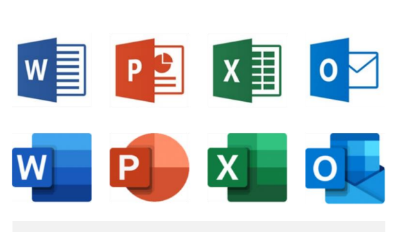

- this list will be replaced by the toc
{:toc .large-only}

## 새로운 사용자 그룹의 등장 
Emergance of new user groups
---

### 동영상 ▶️  

- 정보 검색, 지식 습득, 문화 소비, 소셜 네트워킹 등 동영상 플랫폼은 **멀티 플랫폼으로 확장**되고 있다. 
- **소비자와 생산자 역할을 동시에 수행**하며, 이는 영상의 양과 질이 더욱 높아지게 한다.
- **동영상 추천 알고리즘**은 이러한 동영상 플랫폼의 확장을 더욱 촉진시킨다.

### 1인가구 🏠

- 개인의 가치와 소신 우선시
- 컴퓨터로 인해 연결성이 높아진 세상에서, 단절과 고립을 선택한다는 것이 모순적 
- **Minimalism** 이 새로운 가치를 창출함

### 초고령 사회 👵🏻

- 건강, 오락, 관리 등의 면에서 **시니어 친화적** 상품들에 대한 수요가 높아짐
- Active, Defensive, Care, Gap Senior 다 Needs가 다르다 
- digital-phobia도 고려해야 한다

## 어울릴 것 같지 않은 가치들 
---

사용자 경험 설계의 첫 단계: **_사용자 니즈 파악_**

### MZ 세대 🧑🏻‍🤝‍🧑🏻

- 의견 표출에 적극적, 독립적이며, 치열하게 살면서도 홀가분한 일상을 챙기고자 하는 욕구가 강해졌다.
- **편의성**과 **개인화**를 중시한다.

- **무민족의 등장** : "No Meaning", 강박 내려놓기

- **휘소가치**: unlike before, 주관적인 영역으로 넘어왔다
    - 휘발성 제품이 자신의 가치관과 소신에 부합한다면 구매를 고려한다. (예쁜 쓰레기)
    - 소유보다 **구매와 경험 자체가 중요**함

- **화이트 불편러**: 정의로운 예민함', 사소해 보이는 일이라도 사회적으로 나쁜 영향을 미친다면 소신표현을 통해 문제를 제기

- **Crowd Funding**: 특정 문제에 공감한 다수의 사람들이 문제 해결에 집중 -> 비즈니스 런칭 도움
    - **참여 디자인** (participatory design) <fade>Wadiz, Tumblbug</fade>

### 아날로그 감성에 대한 목마름 📼

추억회상, 향수

- 경험은 기억과 매우 밀접하다 (기억의 밑바탕: 아날로그 감성)
- digital화가 빨라질 수록 목마름은 더욱 강해진다
    - fake analog의 등장 <fade>Gudak</fade>

### 번역기와 인간 대체 🤖

도구의 사용보다는 소통, 본인의 생각 정리, 언어가 상징하는 문화를 소화하기 떄문에 인간은 언어를 계속 배워야 한다
- Mike Schuster, Google 번역 최고 담당자

## 게임과 즐거움을 찾아다닌다
---

재미는 몰입으로 이어진다

### 몰입 🎮

- 집중 정도가 매우 높으며, 다른 생각/걱정이 사라진다
- 동시에 자의식도 사라져 시간의 흐름을 정상적으로 인지 불가
- 그래도 "즐거움"을 느끼기에 사람들은 이를 더욱 경험하고 싶어함 

### Gamification 🎲

**생리적 욕구 > 안전의 욕구 > 사회적 욕구 > 존경의 욕구 > 자아실현의 욕구**

- 게임의 요소를 비게임 환경에 적용하는 것
- ex: 레벨 업, 순위표, 마일리지, 보상 등등 좋은 전략이 된다
- 행동경제학 (behavioral economics)와 밀접하다
- **Nudge**: 사람들의 행동을 바꾸기 위해 어떤 방식으로든 유도하는 것
    - "옆구리를 슬쩍 찌르는 것"
    - ex: 소변기에 파리 그림, 흡연장소에 쓰레기통 등

### Snack Culture 🍿

짧은 시간에 즐길 수 있는 콘텐츠

- 틱톡, 릴스, 쇼츠, 모먼트 등

## 사람과 사람이 연결된다는 것

### 소셜 네트워크 📱

SNS의 특징 (과 대중매체와의 차이점)
1. 접근성 (accessibility) : 적은 비용으로 누구나 이용 가능하다
2. 유용성 (usability) : 전문성과 훈련을 요구하지 않는다
3. 최신성 (recency) : 실시간으로 정보를 제공, 즉각적으로 반응한다. 반응 지체여부는 **소비자들이 결정**한다
4. 영속성 (permanance) : 편집, 코멘트 등을 통해 즉각적으로 수정이 가능 (대중매체는 몇날며칠 걸림)

- **Consumer-to-Consumer** : 양방향적 정보 전달 미디어, 실제 현실에도 영향을 준다

- _United Breaks Guitars_ : SNS의 영향력이 얼마나 큰지 보여주는 사례
    - 유튜브에 올라온 동영상이 유나이티드 항공의 주식가격을 10% 하락시킴

- Digital Facetime, 개인 방송 서비스의 대중화 
    - 사용자가 떠나면 무너지기에 사용자 유지가 중요하다
    - 텍스트 채팅을 조금씩 대체하고 있다

### 돌고 도는 사용자 경험 트렌드 🔁

- 유행이 도는 주기가 존재한다

- 스큐어모피즘 (skeuomorphism) : 실재를 그대로 묘사하고자 함
    - 과거의 디자인을 현대에 적용하는 것
    - `장`: 인지, 조작에 유리하다 (사용자가 익숙한 모습)
    - `단`: 시각적 정보가 필요 이상으로 많아 인지적으로 부담스러울 수 있다

- 플랫디자인 (flat design) : 실재를 묘사하지 않고, 단순화하여 표현하는 것
    - `장`: 시각적으로 깔끔하고, 일관성을 제공한다. 적은 정보량 기반 SW에 속도를 높여준다
    - `단`: 지나친 단순화로 인해 조작에 어려움이 있을 수 있다

- 플랫에서 세미플랫으로 간 MS Office  
    {:.lead width="200" height="50" loading="lazy"}
