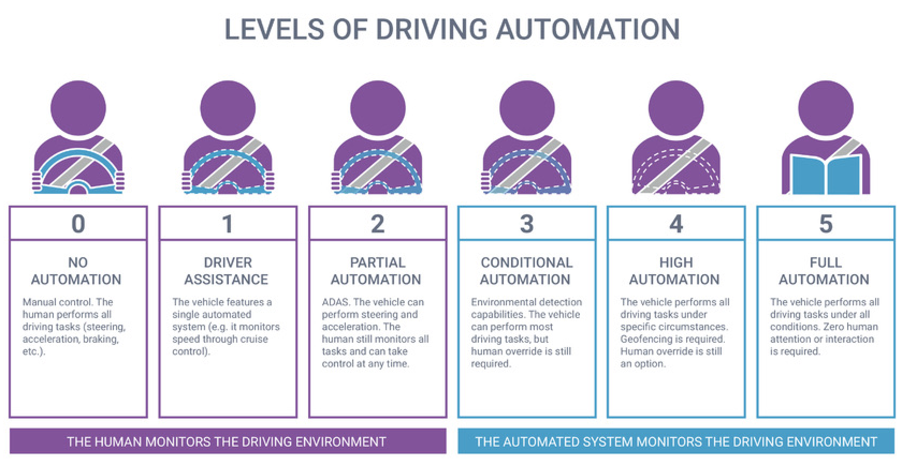
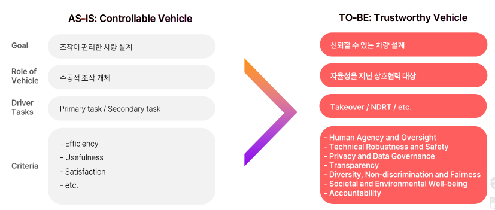

- this list will be replaced by the toc
{:toc .large-only}

## HMI 관점에서의 전통적 사용성 (과거)
Human Machine Interaction

---

### In-Vehicle Usability 초창기 발전 배경 🚜

**(`~2000`) 인간공학적 설계: 주행과업의 효율성**  
- 사용자 겅혐보다는 기술 적용에 초점
- 인체공학적 설계 by Engineers가 주 
- **주행 과업 (Primary Tasks)의 Efficiency**를 높이는 것이 목표
- 이러한 인간공학적 기술 발전/개선 $$\rightarrow$$ 사고, 사망자 수 감소
- 물리적인 설계에 대한 **표준화**가 이루어짐
- <fade>Hyundai의 Packing 부서: 제조로 연결되는, 포인트를 잡기 위해 설계함</fade>

**기술 발전에 따른 In-Vehicle Task 다양화**
- **Secondary Task** 등장: 주행과업 외의 다른 과업
    - <fade>Communication, Comfort, Control Panel, Infotainment, Navigation, etc.</fade>
- **Driver Experience**라는 UX 급부상 
- **IVIS** (In-Vehicle Information System) 에 적용된다
    - 문제점: IVIS의 복잡성 증가 $$\rightarrow$$ 사용자의 주의력 분산 (제공되는 기능,정보 수 증가에 따라)
- HCI 관점에서의 IVIS 사용성이 집중조명됨 

### 차량 맥락을 고려한 Usability 발달 🚗

- 사용성 평가: 1) 효과성, 2) 효율성, 3) 만족도 
    - **맥락**적 접근 (`특정`) already in HCI definition

- IVIS의 사용성 평가 <fade>Primary Task를 심각하게 저하시키지 않는 사용성을 평가하는 중요 전제조건</fade>

1. 이중과업환경: primary, secondary task의 충돌 여부
2. 외부 환경적 조건
3. 사용자의 범위 (실력 range)
4. Trainig 제공: Guide나 Training session 제공
5. 사용빈도: 습관성 사용여부
6. 활용력 (Uptake): perceived usefulness 

- 전통적 차량 Usability 개념 변천사: **Assistance** 들어옴 
    - 전통적으로 있던 task들의 중요도가 변화함

## HAII 관점에서의 사용성 (현재)
Human AI Interaction
---

운전자의 primary task 축소에 따라 운전자 $$\leftrightarrow$$ System (AI)의 관계가 변화함
이에 따라 상호적 협력관계 구축을 위한 **Trust** 형성의 중요성이 대두됨

### DDT & NDRT 🚙

- **DDT** (Dynamic Driving Task)
    1. `Tactical` : 운전 어떻게 할지에 대한 전략, Decision making
    2. `Operational` : 실제 운전 <fade>Steering, Acceleration, Braking</fade> Human Behavior

- **NDRT** (Non-Driving Related Task)
    - 인간이 하는 운전과업 외의 다른 과업
    - Primary task가 축소되니 Secondary task가 더 커졌다. 이 커진 Secondary task를 NDRT로 대체

### 자동화에서 자율화로 
Automation to Autonomy

{:.lead width="200" height="100" loading="lazy"}
[The 6 Levels of Vehicle Autonomy](https://www.3cems.com/the-6-levels-of-vehicle-autonomy_n69)
{:.figcaption}

현 단계: Level 3
- 성공적인 **Takeover** (제어권 전환)을 위해 Trust 형성 필요
- 자율화로 가는 여정에 있어 윤리의식 등이 중요해짐

## Towards New Usability 🚀

**인간과 자동차의 관계**
- 원래: 자동차 = 운전자의 조작 도구
- 현재: 상호작용 (Automation이 운전자의 Decision Making을 assist하며 **동반자**로서의 역할을 함)
- 미래: Trustworthy한 동반자

- 미래 해결과제 (Level 4, 5)
    - **Trust** 형성
    - **사용자 경험**의 중요성
    - 보안문제, transparency, 

{:.lead width="200" height="100" loading="lazy"}

- 물리적 인터페이스의 패러다임 변화
- NDRT종류 다양화
- Augemented Reality (증강현실을 활용한 네비게이션 등)
- Conversational AI (음성인식, 자연어처리 등)
- Gesture-based Interaction
- Tangible Interaction

등 자연스러운 인터렉션을 활용할 수 있는 방법들이 개발되고 있음.
행위나 발화로 부터 차량이 올바르게 운전자의 의도를 읽고 수행하는 것이 중요해질 것으로 예상됨. 무엇보다 **신뢰 형성**이 중요해질 것 
