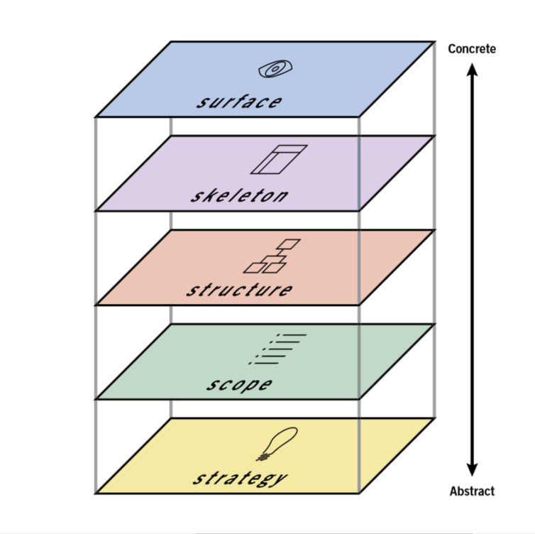
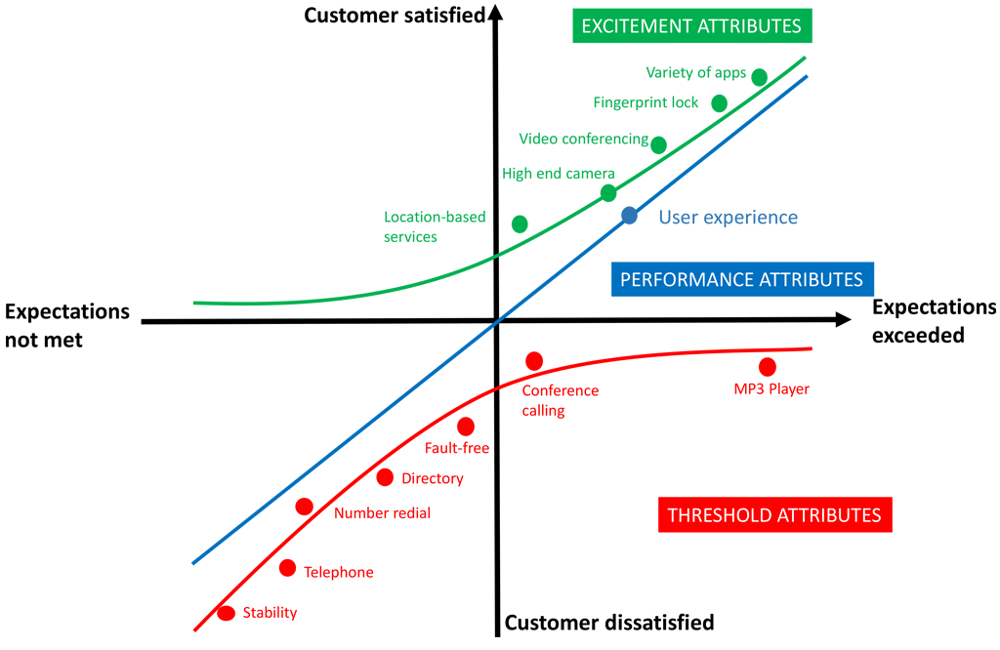
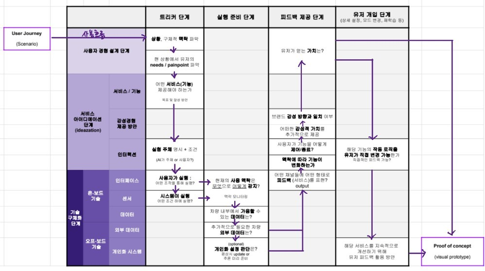

- this list will be replaced by the toc
{:toc .large-only}

## Elements of UX

---

- 5 elements of UX (2002, Jesse James Garrett)
- 각 layer마다 목표와 task가 존재

{:.lead width="100" height="200" loading="lazy"}
The Five Elements of UX — [The Elements of User Experience by Jesse James Garrett](http://www.jjg.net/elements/pdf/elements.pdf)
{:.figcaption}

|   Layer   |                  Concept                  |                                                                 Task                                                                |          Output          |
| :-------: | :---------------------------------------: | :----------------------------------------------------------------------------------------------------------------------------------: | :----------------------: |
|  Surface  |          Visual &  Sensory Design         |                                          Mutlimodal Sensory Experience 제공, high fidelity                                           |      Design Handoff      |
| Skeleton  | Interface, Inforamtion,  Navigation Design |                                                            Visualization                                                             |  Wireframes, Prototypes  |
| Structure |   Interaction Design,  전반적 구조 설명    |                                                    Information Architecture (IA)                                                     | User Flow, User Journey  |
|   Scope   |   Functional Specifications  | User Stories, Use Cases 지속적 가치를 위한 고객 <-> 제품 연결고리  `HTA`, `kano model` main feature & functionality identification | 요구사항, 기능 명세서  |
| Strategy  |      User needs,  product objectives       |                                           find painpoint,  personas,  business model canvas                                            | 기획안, brand concept 등 |

- `IA` (Information Architecture): 날것의 data, $$\approx$$ CS. 큰 기업이 아니면 하기 어려움
- `HTA` (Hierarchical Task Analysis): 일렬의 순서들로 task 도장깨기, 공략적 접근
- `kano model`

{:.lead width="100" height="200" loading="lazy"}
  [What is a Kano Model](https://blog.seeburger.com/what-is-the-kano-model/)
  {:.figcaption}

## UX Thinking Protocols

---

{:.lead width="200" height="50" loading="lazy"}

### Trigger 단계 🔫

- 서비스 **발동 조건 발굴** 단계
- 사용자 여정, 유저 리서치 선행 필요

1. 사용자 경험 설계 lvl : 특정 상황의 맥락, 니즈, 페인포인트 고려
2. 서비스 아이데이션 단계 lvl : 기능 제공 및 목표 구체화, 실행 조건과 주체 고려해 발동조건 결정
3. 기술 구체화 lvl : 구체적인 interface, 센서 고려

### 실행 준비 단계 🏃🏻‍♀️

- 구체적인 기술의 작동방식 고려

1. 기술 구체화 lvl: 사용 맥락 감지, 내부 가용 데이터 고려
2. 추가적인 외부 데이터 고려, if(personalization needed) 유저 데이터 패턴화 및 활용 가능성 고려

### 피드백 제공 단계 📢

- 사용자가 서비스/기능을 구체적으로 어떻게 인지하는지 결정
- 맥락, 방법 뿐 아니라 **유저가 이 기능으로부터 얻는 가치 고려**

1. 기술 구체화 lvl: 어떤 감각 채널들을 통해 피드백을 제공할 것인지 결정
2. 서비스 아이디에이션 lvl: 브랜드 가치, 감성적 요인 고려
3. 사용자 경험 설계 단계 lvl: 유저가 얻는 가치 결정

### 유저 개임 단계 🎮

상세 설정, 모드 변경 등 시스템의 재학습 등 유저가 기능에 직접적으로 개입하는 상태

1.  서비스 아이데이션 lvl: 유저가 직접적으로 개입가능 여부
2.  기술 구체화 lvl: 지속적 개선 가능 여부, 피드백 수집 및 활용 방안

### 최종 🏆

서비스를 설계하고 Visual PoC (Proof of Concept)를 통해 서비스의 구현가능성을 검증함

