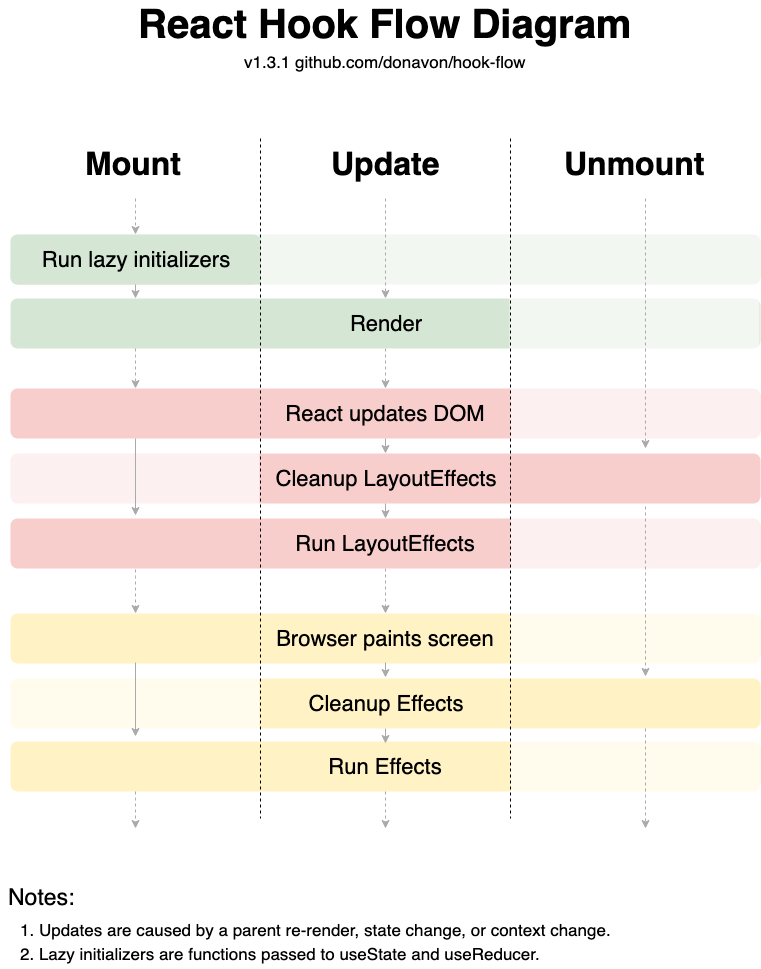

- this list will be replaced by the toc
  {:toc .large-only}

## 7/22: Type vs Interface

---

> 회사에서 `interface` 금지하는 컨벤션이 궁금해졌다

**_Similarities_**

1. 객체 shape
2. index signature 가능

```js
interface IObj {
  [key: string]: any;
}

type TObj = {
  [key: string]: any,
};
```

**_Differences_**

1. Declaration Merging (선언 병합)

   - `interface`는 선언 병합 가능
   - `type`은 불가능

   ```js
   interface User {
     name: string;
   }

   interface User {
     age: number;
   }

   // Merged into: interface User { name: string; age: number; }

   type UserType = {
     name: string,
   };

   type UserType = {
     age: number,
   }; // Error: Duplicate identifier 'UserType'.
   ```

2. `type` complex 가능 (unions, intersections, mapped types etc)

   ```js
   type Status = "success" | "error" | "pending";

   type UnionType = User | UserType;

   type PartialUser = Partial<UserType>;
   ```

3. Inheritance

   - `type`: `&` 사용 (intersection)
   - interface: `extends` 사용

4. Primitive Alias (TYPEONLY)

   - `type`은 primitive type alias 가능

   ```js
   type Name = string;
   ```

5. Function Types: (type이 더 concise)

   ```js
   type Add = (a: number, b: number) => number;

   interface IAdd {
     (a: number, b: number): number;
   }
   ```

6. Tuple Types

   - `type`만 가능

   ```js
   type Tuple = [number, string];
   interface TupleInterface {} // Not applicable for tuples.
   ```

| Interface                                                       | Type                                          |
| --------------------------------------------------------------- | --------------------------------------------- |
| 다른 interface/clases 에 의해 extension, implementation 필요 시 | complex type def                              |
| ideal for API contracts                                         | when felxible, maipulative types are required |

## 7/23: Named vs Default Export

- [Treeshaking](https://webpack.js.org/guides/tree-shaking/) (tree shaking): dead code 제거

- Named Export (`import {a, b, c} from 'abc'` )

  - 이름이 정해져 있어 consistency 유지에 좋음 (물론 renaming 가능)
  - bundler (ex: Webpack) 이 treeshaking 할 때 좋다 (final bundle에 미사용 코드 제거)

- Default Export (`import abc from 'abc'` )

  - import 시 이름 정해야 함 (flexibility)
  - airbnb js styled guide: 하나만 export할 때는 `default` 사용
  - tree shaking 시 named export 보다 더 어려움

1. [What is the benefit of prefer-default-export](https://github.com/airbnb/javascript/issues/1365?source=post_page-----38fa5d7f57d4--------------------------------)
2. [Why and when to use default export over named exports in es6 Modules](https://stackoverflow.com/questions/46913851/why-and-when-to-use-default-export-over-named-exports-in-es6-modules)

## 7/24: useLayoutEffect

- **Render**: calculating element styles for DOM Tree
- **Paint**: 실제 스크린에 layout 표시하고 업데이트

{:.lead width="800" height="400" opacity="1" loading="lazy"}

- `useEffect`: **비동기적**으로 실행된다.

  - component render -> paint -> `useEffect`
  - => useEffect내부에 DOM 조작이 있을 경우, **화면이 깜빡**일 수 있다.

- `useLayoutEffect`: **동기적으로 실행**된다.

  - component render -> `useLayoutEffect` -> paint
  - => 화면 깜빡이지 않는다.
  - => 로직 복잡할 경우 사용자가 화면을 보기까지 시간이 오래 걸릴 수 있다.

- 기본적으로 useEffect 사용
  - data fetching, event handling, state resetting (UI와 관련 없는 작업)
- 화면에 렌더링이 필요한 경우 useLayoutEffect 사용 괜찮음
  - 렌더링 직후 DOM요소를 읽을 때 유용 (scroll position 등)

## 8/5: React FC 사용 지양하기

> ⚠️ React 18 이상에서 React.FC는 사라졌다

- cra 기본 템플릿에서 사라짐

1. implicit `children`

   - `React.FC` 사용 시 `children` prop이 optional로 간주됨
   - prop에 children이 추가되지 않았음에도 불구하고 children 넘기기 가능
   - 런타임 에러 발생 X (`FC`미사용 시 잡을 수 있음)
   - TS뿐만 아니라 거의 모든 프로그래밍 언어에서 안티패턴임

2. 타입스크립트의 제네릭 문법을 지원하지 않는다.


> [React.FC 사용 지양하기 velog 글](https://velog.io/@frombozztoang/React.FC-%EC%82%AC%EC%9A%A9-%EC%A7%80%EC%96%91%ED%95%98%EA%B8%B0#reactfc-%EC%82%AC%EC%9A%A9%EC%9D%84-%EC%A7%80%EC%96%91%ED%95%B4%EC%95%BC-%ED%95%98%EB%8A%94-%EC%9D%B4%EC%9C%A0) 토대로 작성함
